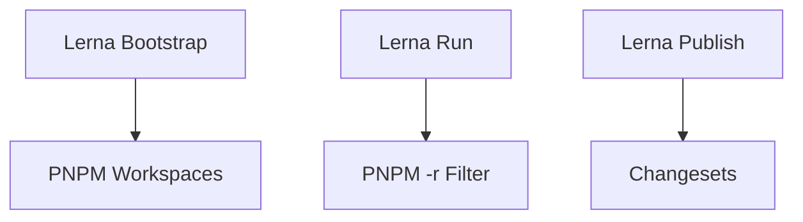

# Build System Migration Analysis

## Current System Overview

- Lerna v4 (legacy)
- npm-run-all for script orchestration
- TypeScript project references
- Cosmos for component development
- Jest/Vite testing stack

## Key Migration Targets

1. Replace Lerna with PNPM workspaces
2. Modernize build orchestration
3. Maintain TypeScript project references
4. Preserve CI/CD workflows

## Migration Analysis

### 1. Package Management (Lerna → PNPM)



### 2. Script Orchestration

| Legacy Command    | PNPM Equivalent            |
| ----------------- | -------------------------- |
| `lerna bootstrap` | `pnpm install` (automatic) |
| `lerna run build` | `pnpm -r build`            |
| `lerna link`      | Not needed (auto-symlinks) |
| `lerna version`   | `changeset version`        |
| `lerna publish`   | `changeset publish`        |

### 3. TypeScript References

Current setup uses custom `setup-references.mjs`. PNPM workspaces can simplify this through:

```json
// tsconfig.json
{
  "references": [{ "path": "packages/default-icons" }, { "path": "packages/ui-kit" }]
}
```

### 4. CI/CD Impact

```diff
# .github/workflows/build.yml
- uses: lerna/setup-lerna@v1
+ uses: pnpm/action-setup@v2
- run: npm run bootstrap
+ run: pnpm install
- run: lerna run build
+ run: pnpm -r build
```

## Migration Steps

1. **Core Changes**

   ```powershell
   # Remove Lerna
   pnpm remove lerna
   # Add modern alternatives
   pnpm add -D @changesets/cli turbo
   ```

2. **Workspace Configuration**

   ```json:package.json
   {
     "private": true,
     "scripts": {
       "prepare": "pnpm install && husky install",
       "build": "pnpm -r build"
     },
     "pnpm": {
       "overrides": {
         "@turf/difference": "6.0.1"
       }
     }
   }
   ```

3. **Versioning/Publishing**
   ```json:package.json
   {
     "scripts": {
       "release": "changeset",
       "publish": "changeset publish"
     }
   }
   ```

## Risk Analysis

1. **Dependency Conflicts**

   - Current `resolutions` → PNPM `overrides`
   - Verify with `pnpm why <package>`

2. **Build Order**

   - Replace `run-s`/`run-p` with Turborepo pipelines

   ```json:turbo.json
   {
     "pipeline": {
       "build": {
         "dependsOn": ["^build"],
         "outputs": ["dist/**"]
       }
     }
   }
   ```

3. **Testing Workflows**
   - Jest/Vite integration remains unchanged
   - Update test commands:
   ```json:package.json
   {
     "scripts": {
       "test": "pnpm -r test"
     }
   }
   ```

## Migration Timeline

1. Phase 1: PNPM Workspace Setup (2 days)
2. Phase 2: Build System Refactor (3 days)
3. Phase 3: CI/CD Updates (1 day)
4. Phase 4: Validation/Testing (2 days)

## Recommended Action Plan

1. Create `pnpm-workspace.yaml`
2. Migrate Lerna commands incrementally
3. Implement Turborepo for task orchestration
4. Adopt Changesets for version management
5. Update GitHub Actions workflows

```yaml:pnpm-workspace.yaml
packages:
  - 'packages/*'
```
