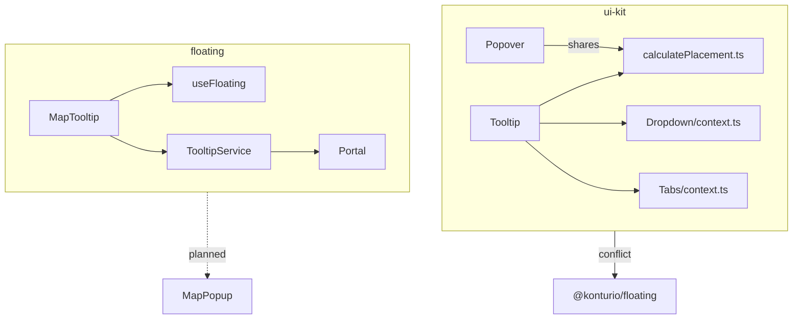
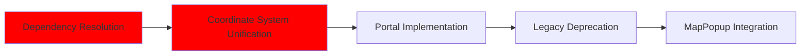

# Floating UI Components Audit Report

## Executive Summary

Analysis reveals 2 distinct implementation patterns coexisting:

1. **Legacy System** (ui-kit): Class-based components with manual positioning
2. **Modern System** (floating): Functional components using Floating UI patterns

## Component Matrix

| Component        | Location             | Tech Stack             | Status     | Key Dependencies                   |
| ---------------- | -------------------- | ---------------------- | ---------- | ---------------------------------- |
| Tooltip (Legacy) | ui-kit/src/Tooltip   | CSS Modules + Context  | Deprecated | Dropdown/Tabs contexts             |
| Popover          | ui-kit/src/Popover   | Class Components       | Active     | Manual rect calculations           |
| MapTooltip (WIP) | floating/src/Tooltip | Floating UI + Maplibre | Alpha      | Map canvas integration             |
| Dropdown         | ui-kit/src/Dropdown  | Context API            | Active     | @konturio/floating (broken import) |

## Dependency Map



## Key Findings

1. **Positioning Systems Conflict**

```typescript
// Legacy (ui-kit/Tooltip)
function calculatePlacement(target: DOMRect, tooltip: DOMRect) {
  // Manual boundary checks
}

// Modern (floating/Tooltip)
const { x, y, refs } = useFloating({
  middleware: [autoPlacement(), offset(4)],
});
```

2. **Context System Fragmentation**

```typescript
// ui-kit/Dropdown/context.ts
createContext(); // Isolated implementation

// floating/TooltipService.ts
class TooltipService {
  /* Standalone manager */
}
```

3. **Map Integration Challenges**

```typescript
// MapTooltip.fixture.tsx
map.on('click', (e) => {
  tooltip.show(e.point); // Screen coordinates
  tracker.trackPointPosition(e.lngLat); // Geo coordinates
});
```

## Critical Path Analysis



## Action Plan

1. **Immediate Actions**

```powershell
# Find broken imports
rg '@konturio/floating' packages/

# List all Tooltip consumers
sg -p 'Tooltip' --json | jq '.matches[].file'
```

2. **Migration Priorities**

```text
1. Resolve @konturio/floating import conflict
2. Create unified positioning service
3. Implement shared portal root
4. MapTooltip coordinate system tests
```
